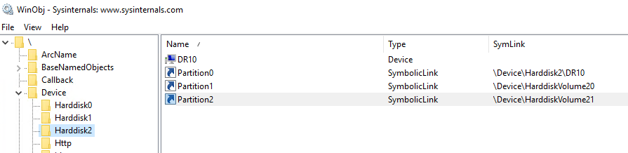

class: center, middle, inverse
## Windowsコンテナのしくみ

---
### whoami

.left-small[
    
]

.right-large[
.tmp[
- Kyohei Mizumoto(@kyohmizu)
]

.tmp[
- C# Software Engineer
]

.tmp[
- Interests
  - Cloud Native
  - Docker
  - Kubernetes
  - Golang
  - Azure
]
]

---
### 今日話すこと

.zoom2[
.tmp[
- Windowsコンテナの概要
]

.tmp[
- Windowsコンテナのアーキテクチャ
  - HCS
  - HNS
]
.tmp[
- コンテナを実行して色々確認
]
]

---
class: header-margin
### より詳しく知りたい方は

<center></center>

---
### Windowsコンテナの特徴

.zoom1[
.tmp[
- 2つの分離モード
  - プロセス分離、Hyper-V分離
  - `--isolation` オプションで指定
]

.tmp[
- 4つのベースイメージ  
  .zoom1[<u><https://docs.microsoft.com/en-us/virtualization/windowscontainers/manage-containers/container-base-images></u>]
]

.tmp[
- コンテナはホストOSのバージョンに依存
  - プロセス分離の場合、同一バージョンのイメージのみ実行可能
]

.tmp[
- ドキュメントがない、少ない
]
]

---
### Get Started

.zoom01[
.tmp[
- Dockerをインストール

```powershell
PS> Install-Module -Name DockerMsftProvider -Repository PSGallery -Force
PS> Install-Package -Name docker -ProviderName DockerMsftProvider
PS> Restart-Computer -Force
```

- 再起動後、docker コマンドが有効に
- HNS (後述)の管理モジュールもインストールされる

```powershell
PS> docker version
PS> Get-HnsNetwork
```
]

.tmp[
- Hyper-Vを有効化

```powershell
PS> Install-WindowsFeature -Name Hyper-V -IncludeManagementTools -Restart
```
]
]

---
class: header-margin
### アーキテクチャ (Linux)

.half-3[
<center></center>
]

.zoom0-r[
引用：<u>https://qiita.com/kikuchi_kentaro/items/2fb0171e18821d402761</u>
]

---
class: header-margin
### アーキテクチャ (Windows)

.half-3[
<center></center>
]

.zoom0-r[
引用：<u>https://qiita.com/kikuchi_kentaro/items/2fb0171e18821d402761#hcs--host-compute-service-</u>
]

---
### インターフェイス

.zoom1[
.tmp[
- HCS (Host Compute Service)
  - コンテナ管理のための低レベル機能をAPIとして提供
  - cgroups、namespace 等の役割
  - 実体は `vmcompute.dll`
  - Docker ではGo Wrapperの `hcsshim` を使用
]

.tmp[
- HNS (Host Networking Service)
  - 仮想スイッチやエンドポイント、ポリシーの作成等を行う
  - 5つのネットワークドライバをサポート  
    (nat, overlay, transparent, l2bridge, l2tunnel)
  - `hcsshim` に含まれる
  - 今は HCN (Host Compute Networking) と呼ばれる？
]
]

---
### コンテナランタイム

.zoom1[
<u><https://github.com/microsoft/hcsshim/tree/master/cmd/runhcs></u>

- runhcs
  - OCI準拠のコンテナランタイム
  - `runc` をforkしたもの
  - Windowsコンテナのプロセス分離とHyper-V分離、LCOWに対応
  - containerd (on Windows) + runhcs の構成

```cmd
runhcs run [ -b bundle ] <container-id>
```

- Docker では `hcsshim` で直接HCS、HNSを呼び出している
]

---
class: header-margin
### Linuxコンテナとの機能比較

.half-3[
<center></center>
]

.zoom0-r[
引用：<u>https://www.slideshare.net/Docker/windows-container-security</u>
]

---
### Kernel Isolation in Windows

.zoom01[
.tmp[
- Job Objects
  - プロセスをグループ化して管理
  - グループ毎にリソースを制限  
    <u><https://docs.microsoft.com/en-us/windows/win32/procthread/job-objects></u>
]

.tmp[
- Silos
  - Job Objectを拡張し、namespaceやレジストリ等を分離
.zoom2[<u><https://docs.microsoft.com/en-us/archive/msdn-magazine/2017/april/containers-bringing-docker-to-windows-developers-with-windows-server-containers></u>]
]

.tmp[
- Syscall Filtering
  - コンテナ内からのWin32kシステムコールを制限  
    <u><https://improsec.com/tech-blog/win32k-system-call-filtering-deep-dive></u>
]

.tmp[
- Sandoxing
  - Linux Capability相当の機能
]
]

---
### Union File System

.zoom1[
.zoom1[
<u><https://xebia.com/blog/deep-dive-into-windows-server-containers-and-docker-part-2-underlying-implementation-of-windows-server-containers/></u>
]

.tmp[
- WindowsアプリはNTFSセマンティクスを想定
  - トランザクション、USN Journal等
  - 完全なunionFSを作成するのが困難
]

.tmp[
- ハイブリッドモデルを採用
  - コンテナ毎に仮想ブロックデバイス + NTFSパーティション
  - ブロックデバイスのサイズを小さくするためsymlinkを使用
]

.tmp[
- 実体はwcifs.sys(Windows Container Isolation FS Filter Driver)
]
]

---
class: header-margin
### ネットワーク

.half-3[
.zoom01[
- コンテナに仮想NICを割り当て
- Hyper-V virtual switch (vSwitch)経由で接続

<center></center>
]
]

.zoom0-r[
引用：<u>https://docs.microsoft.com/en-us/virtualization/windowscontainers/container-networking/architecture</u>
]

---
class: center, middle, blue
## 動作確認

---
### 環境

.zoom1[
.tmp[
- Microsoft Azure VM

]

<center></center>

.tmp[
- Windowsプロセス分離コンテナを実行
  - nat ネットワーク (Default)

.zoom01[
```powershell
PS> docker container run -it --isolation process mcr.microsoft.com/windows/servercore:1809 powershell
PS> docker container ls -q
#56dae625d7c0
```
]
]
]

---
### Job Objects

.zoom01[
- `\` 内にコンテナのJob Objectが追加されている

.zoom2[
```powershell
PS> docker container inspect --format="{{.Id}}" 56dae625d7c0
#56dae625d7c0d69235147f0c8f1b4aa64ac9c51f92a03f35e5ba168d30d7817a
```

<center></center>
]
]

---
### Silos

.zoom01[
- JID (Job ID)経由で割り当て

<center></center>

]

---
### リソース制限

.zoom01[
- メモリに制限をかける

.zoom1[
```powershell
PS> docker container run -it --isolation process -m "100m" mcr.microsoft.com/windows/nanoserver:1809
```
]

<center></center>
]

---
### 割り当てボリューム

.zoom01[
.zoom1[
<u><https://qiita.com/kikuchi_kentaro/items/2fb0171e18821d402761#change-root></u>
]

<center></center>

<center></center>
]

---
### 割り当てボリューム

.zoom01[
- Disk2のPartition2にマウントされている

.zoom01[
```powershell
PS> diskpart
DISKPART> list vdisk
# VDisk ###  Disk ###  State                 Type       File
# ---------  --------  --------------------  ---------  ----
# VDisk 0    Disk 2    Attached not open     Expandable  
# C:\ProgramData\docker\windowsfilter\56dae625d7c0d69235147f0c8f1b4aa64ac9c51f92a03f35e5ba168d30d7817a\sandbox.vhdx
```
]

- コンテナを停止してホストに割り当て

.zoom01[
```powershell
DISKPART> select vdisk file=`
"C:\ProgramData\docker\windowsfilter\56dae625d7c0d69235147f0c8f1b4aa64ac9c51f92a03f35e5ba168d30d7817a\sandbox.vhdx"
DISKPART> attach vdisk
# 100 percent completed
# DiskPart successfully attached the virtual disk file.
DISKPART> list vol
# Volume ###  Ltr  Label        Fs     Type        Size     Status     Info
# ----------  ---  -----------  -----  ----------  -------  ---------  --------
# ...
# Volume 3                      NTFS   Partition     19 GB  Healthy

DISKPART> select volume 3
# Volume 3 is the selected volume.
DISKPART> assign letter=x
# DiskPart successfully assigned the drive letter or mount point.
```
]
]

---
### 割り当てボリューム

.zoom01[
- 中身が確認できた
]

<center></center>

---
### ネットワーク設定 (nat)

.zoom01[
.zoom0[
```powershell
PS> docker network inspect 5bdb5d65193e
[
    {
        "Name": "nat",
        "Id": "5bdb5d65193e0f2c75324bfb491bddfdfe832fbc5274b17bb65ffc159b813c35",
        "Created": "2020-01-16T00:33:51.3521196Z",
        "Scope": "local",
        "Driver": "nat",
        "EnableIPv6": false,
        "IPAM": {
            "Driver": "windows",
            "Options": null,
            "Config": [
                {
                    "Subnet": "192.168.48.0/20",
                    "Gateway": "192.168.48.1"
                }
            ]
        },
        "Internal": false,
        "Attachable": false,
        "Ingress": false,
        "ConfigFrom": {
            "Network": ""
        },
        "ConfigOnly": false,
        "Containers": {},
        "Options": {
            "com.docker.network.windowsshim.hnsid": "AB1F91D2-F403-409F-8E8A-F70BF850CC30",
            "com.docker.network.windowsshim.networkname": "nat"
        },
        "Labels": {}
    }
]
```
]
]

---
### ネットワーク設定 (nat)

.zoom01[
.zoom1[
```powershell
# 実体はDockerインストール時に作成された仮想NIC

PS> Get-NetAdapter -Name "vEthernet (nat)" `
| fl Name,MacAddress,DeviceID,DeviceName,InterfaceIndex,InterfaceName,InterfaceType,Virtual
#Name           : vEthernet (nat)
#MacAddress     : 00-15-5D-70-3C-17
#DeviceID       : {1D1CEF6D-9BB1-4C9A-B594-7BA93992DF73}
#DeviceName     : \Device\{1D1CEF6D-9BB1-4C9A-B594-7BA93992DF73}
#InterfaceIndex : 8
#InterfaceName  : ethernet_32771
#InterfaceType  : 6
#Virtual        : True

PS> Get-NetIPAddress | ? {$_.InterfaceIndex -eq 8} `
| fl IPAddress,InterfaceAlias,AddressFamily,IPAddress,Type
#IPAddress      : fe80::6d79:bf22:3a:e5bb%8
#InterfaceAlias : vEthernet (nat)
#AddressFamily  : IPv6
#IPAddress      : fe80::6d79:bf22:3a:e5bb%8
#Type           : Unicast

#IPAddress      : 192.168.48.1
#InterfaceAlias : vEthernet (nat)
#AddressFamily  : IPv4
#IPAddress      : 192.168.48.1
#Type           : Unicast
```
]
]

---
### ネットワーク設定 (nat)

.zoom01[
.zoom1[
```powershell
# 以下のコマンドでも確認可能

PS> ipconfig /all
#Ethernet adapter vEthernet (nat):
#
#   Connection-specific DNS Suffix  . :
#   Description . . . . . . . . . . . : Hyper-V Virtual Ethernet Adapter
#   Physical Address. . . . . . . . . : 00-15-5D-70-3C-17
#   DHCP Enabled. . . . . . . . . . . : No
#   Autoconfiguration Enabled . . . . : Yes
#   Link-local IPv6 Address . . . . . : fe80::6d79:bf22:3a:e5bb%8(Preferred)
#   IPv4 Address. . . . . . . . . . . : 192.168.48.1(Preferred)
#   Subnet Mask . . . . . . . . . . . : 255.255.240.0
#   Default Gateway . . . . . . . . . :
#   DHCPv6 IAID . . . . . . . . . . . : 134223197
#   DHCPv6 Client DUID. . . . . . . . : 00-01-00-01-25-96-9D-2D-00-0D-3A-CC-CE-DC
#   DNS Servers . . . . . . . . . . . : fec0:0:0:ffff::1%1
#                                       fec0:0:0:ffff::2%1
#                                       fec0:0:0:ffff::3%1
#   NetBIOS over Tcpip. . . . . . . . : Enabled

PS> netsh int ipv4 show int
# Idx     Met         MTU          State                Name
# ---  ----------  ----------  ------------  ---------------------------
# ...
#   8        5000        1500  connected     vEthernet (nat)
```
]
]

---
### ネットワーク設定 (コンテナ)

.zoom01[
.zoom0[
```powershell
PS> docker container inspect 56dae625d7c0
"NetworkSettings": {
    "Bridge": "",
    "SandboxID": "56dae625d7c0d69235147f0c8f1b4aa64ac9c51f92a03f35e5ba168d30d7817a",
    "HairpinMode": false,
    "LinkLocalIPv6Address": "",
    "LinkLocalIPv6PrefixLen": 0,
    "Ports": {},
    "SandboxKey": "56dae625d7c0d69235147f0c8f1b4aa64ac9c51f92a03f35e5ba168d30d7817a",
    "SecondaryIPAddresses": null,
    "SecondaryIPv6Addresses": null,
    "EndpointID": "",
    "Gateway": "",
    "GlobalIPv6Address": "",
    "GlobalIPv6PrefixLen": 0,
    "IPAddress": "",
    "IPPrefixLen": 0,
    "IPv6Gateway": "",
    "MacAddress": "",
    "Networks": {
        "nat": {
            "IPAMConfig": null,
            "Links": null,
            "Aliases": null,
            "NetworkID": "5bdb5d65193e0f2c75324bfb491bddfdfe832fbc5274b17bb65ffc159b813c35",
            "EndpointID": "7b9b8eea699c59e7943031d67e81d34e7e077f3d74b17866d6c137a72b71ceed",
            "Gateway": "192.168.48.1",
            "IPAddress": "192.168.51.62",
            "IPPrefixLen": 24,
            "IPv6Gateway": "",
            "GlobalIPv6Address": "",
            "GlobalIPv6PrefixLen": 0,
            "MacAddress": "00:15:5d:70:38:c8",
            "DriverOpts": null
        }
    }
}
```
]
]

---
### ネットワーク設定 (コンテナ)

.zoom01[
.zoom1[
```powershell
# コンテナに割り当てられる仮想NICの確認

# コンテナ内
(CONTAINER) PS> Get-NetAdapter `
| fl -Property Name,MacAddress,DeviceID,DeviceName,InterfaceIndex,InterfaceName,InterfaceType,Virtual
#Name           : vEthernet (Ethernet) 5
#MacAddress     : 00-15-5D-70-38-C8
#DeviceID       : {FEAD9E20-FE87-4FE4-A91C-4EA8FEAD738E}
#DeviceName     :
#InterfaceIndex : 17
#InterfaceName  : iftype0_0
#InterfaceType  : 0
#Virtual        :

# ホスト側
PS> Get-NetAdapter -Name "vEthernet (Ethernet) 5" `
| fl Name,MacAddress,DeviceID,DeviceName,InterfaceIndex,InterfaceName,InterfaceType,Virtual
#Name           : vEthernet (Ethernet) 5
#MacAddress     : 00-15-5D-70-38-C8
#DeviceID       : {FEAD9E20-FE87-4FE4-A91C-4EA8FEAD738E}
#DeviceName     : \Device\{FEAD9E20-FE87-4FE4-A91C-4EA8FEAD738E}
#InterfaceIndex : 17
#InterfaceName  : ethernet_32775
#InterfaceType  : 6
#Virtual        : True
```
]
]

---
### ネットワーク設定 (コンテナ)

.zoom01[
.zoom1[
```powershell
# コンテナのIPアドレス

# コンテナ内
(CONTAINER) PS> Get-NetIPAddress | ? {$_.InterfaceIndex -eq 17} `
| fl -Property IPAddress,InterfaceIndex,InterfaceAlias,AddressFamily
#IPAddress      : fe80::e433:a183:579:ac65%17
#InterfaceIndex : 17
#InterfaceAlias : vEthernet (Ethernet) 5
#AddressFamily  : IPv6

#IPAddress      : 192.168.51.62
#InterfaceIndex : 17
#InterfaceAlias : vEthernet (Ethernet) 5
#AddressFamily  : IPv4

(CONTAINER) PS> Get-NetIPConfiguration | ? {$_.InterfaceIndex -eq 17} | ft -Property `
InterfaceIndex,@{Expression={$_.IPv4Address}},@{Expression={$_.IPv4DefaultGateway.NextHop}}
#InterfaceIndex $_.IPv4Address $_.IPv4DefaultGateway.NextHop
#-------------- -------------- -----------------------------
#            17 192.168.51.62  192.168.48.1

# ホスト側
PS> Get-NetIPAddress | ? {$_.InterfaceIndex -eq 17} `
| fl -Property IPAddress,InterfaceIndex,InterfaceAlias,AddressFamily
# ホストからは確認できない
```
]
]

---
### ネットワーク設定 (コンテナ)

.zoom1[
.zoom0[
```powershell
# HNS Networkでコンテナ数を確認できる

PS> Get-HnsNetwork
#ActivityId             : 47E672B6-69C8-4A35-AB2C-02E8B88F2C76
#AdditionalParams       :
#CurrentEndpointCount   : 1    ← ネットワーク内のコンテナ数
#Extensions             : {@{Id=E7C3B2F0-F3C5-48DF-AF2B-10FED6D72E7A; IsEnabled=False; Name=Microsoft Windows Filtering
#                         Platform}, @{Id=E9B59CFA-2BE1-4B21-828F-B6FBDBDDC017; IsEnabled=False; Name=Microsoft Azure
#                         VFP Switch Extension}, @{Id=EA24CD6C-D17A-4348-9190-09F0D5BE83DD; IsEnabled=True;
#                         Name=Microsoft NDIS Capture}}
#Flags                  : 0
#Health                 : @{AddressNotificationMissedCount=0; AddressNotificationSequenceNumber=0;
#                         InterfaceNotificationMissedCount=0; InterfaceNotificationSequenceNumber=0; LastErrorCode=0;
#                         LastUpdateTime=132236084313701171; RouteNotificationMissedCount=0;
#                         RouteNotificationSequenceNumber=0}
#ID                     : AB1F91D2-F403-409F-8E8A-F70BF850CC30
#IPv6                   : False
#LayeredOn              : 29D2B655-EC21-4157-9343-868669D233CE
#MacPools               : {@{EndMacAddress=00-15-5D-70-3F-FF; StartMacAddress=00-15-5D-70-30-00}}
#MaxConcurrentEndpoints : 1
#Name                   : nat
#NatName                : ICS1D1CEF6D-9BB1-4C9A-B594-7BA93992DF73
#Policies               : {}
#Resources              : @{AdditionalParams=; AllocationOrder=2; Allocators=System.Object[]; Health=;
#                         ID=47E672B6-69C8-4A35-AB2C-02E8B88F2C76; PortOperationTime=0; State=1; SwitchOperationTime=0;
#                         VfpOperationTime=0; parentId=79DDED38-22DF-4929-8B77-F870D6646077}
#State                  : 1
#Subnets                : {@{AdditionalParams=; AddressPrefix=192.168.48.0/20; GatewayAddress=192.168.48.1; Health=;
#                         ID=1A5FE614-132F-44E2-A58A-049BEE86F2A4; Policies=System.Object[]; State=0}}
#TotalEndpoints         : 5
#Type                   : nat
#Version                : 38654705666
```
]
]

---
class: center, middle, blue
## 今回はここまで…

---
class: header-margin
### (再掲) より詳しく知りたい方は

<center></center>

---
### 参考

.zoom1[
.zoom01[
Docker Desktop の復習と、Windows Container に入門: Windows Server Container 理論編  
<u><https://qiita.com/kikuchi_kentaro/items/2fb0171e18821d402761></u>

Introducing the Host Compute Service (HCS)  
<u><https://techcommunity.microsoft.com/t5/containers/introducing-the-host-compute-service-hcs/ba-p/382332></u>

Containers on Windows Documentation  
<u><https://docs.microsoft.com/en-us/virtualization/windowscontainers/></u>

Windows container security  
<u><https://www.slideshare.net/Docker/windows-container-security></u>

Deep dive into Windows Server Containers and Docker – Part 2  
<u><https://xebia.com/blog/deep-dive-into-windows-server-containers-and-docker-part-2-underlying-implementation-of-windows-server-containers/></u>

Bringing Docker To Windows Developers with Windows Server Containers
<u><https://docs.microsoft.com/en-us/archive/msdn-magazine/2017/april/containers-bringing-docker-to-windows-developers-with-windows-server-containers></u>
]
]

---
class: center, middle, blue
## Thank you!
